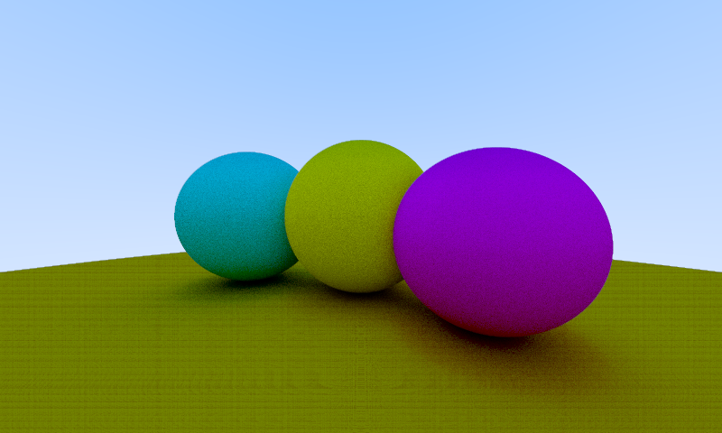
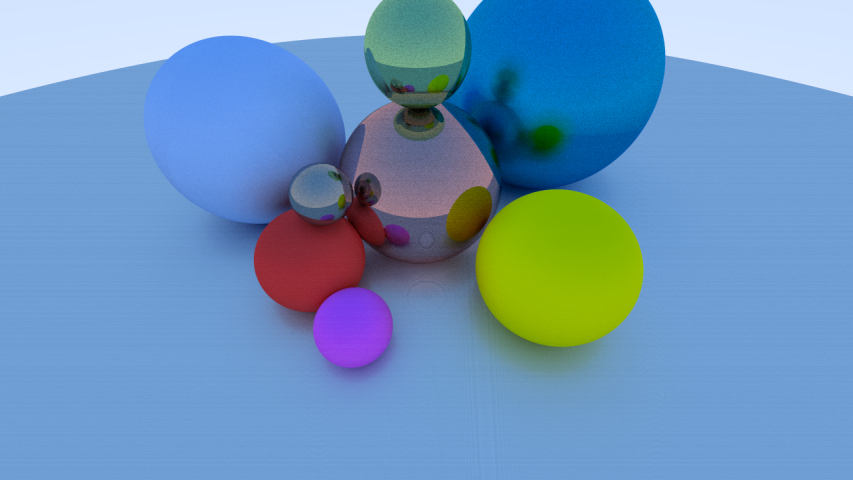

## SH-RayTracer





`SH-RayTracer` is open sourced CPU ray-tracing application, coded based on C++17. 

## Features

* Customized Scene Loading using `json` file.
* Basic Material (`Lambertian`, `Metal`, `Dielectric`) Implementation
* Mutli-thread Rendering
* Customizable configuration using execute command arguments.
* Rendering Time Checking

## Installation

`SH-RayTracer` uses CMake as building system to support cross-platform. There are different ways to compile and build application by each platform.

### Common

`SH-RayTracer` uses below sub-libraries.

* DyUtils
  * DyMath
  * DyExpression
* stb
* nlohmann
* (optional) boost 1.70.0

To build `SH-RayTracer`, `DyUtils` library uses submodule, so need to command below codes prior to use CMake commands.

``` bash
> git submodule update --init --recursive
```

If you want to use application with more informatively, install `boost 1.70.0` library into below path following platform.

| Platform | Path     |
| -------- | -------- |
| Windows  | C:\boost |

### Windows

To build `SH-RayTracer` with visual studio, Visual Studio 2017 or latest required.

Recommend to use CMake GUI version or first make `./build` directory and cmake (optionally, add DyUtils flags like below)

``` bash
> mkdir build && cd build
> cmake .. -DMATH_BUILD_LIB=ON -DMATH_BUILD_WITH_BOOST=ON
> or, cmake .. -DEXPR_BUILD_WITH_BOOST=ON -DMATH_BUILD_LIB=ON -DMATH_BUILD_WITH_BOOST=ON
```

Afterward, open `ShRayTracer.sln` in `./build` directory and build `ALL_BUILD`.

### Linux with gcc (g++)

To build `SH-RayTracer` with g++ on `-inx`, C++17 Supported version is required.

``` bash
> mkdir build && cd build
> cmake .. -DMATH_BUILD_LIB=ON -DMATH_BUILD_WITH_BOOST=ON
> or, cmake .. -DEXPR_BUILD_WITH_BOOST=ON -DMATH_BUILD_LIB=ON -DMATH_BUILD_WITH_BOOST=ON
```

and

``` bash
> make
```

In linux version, I do not provide `Release` version yet. But I'll add optimized version (`Release`) building soon.

## Log

2019-06-04 : Create Document

## Copyright

> ```
> MIT License
> 
> Copyright (c) 2019 Jongmin Yun (Neu.)
> 
> Permission is hereby granted, free of charge, to any person obtaining a copy
> of this software and associated documentation files (the "Software"), to deal
> in the Software without restriction, including without limitation the rights
> to use, copy, modify, merge, publish, distribute, sublicense, and/or sell
> copies of the Software, and to permit persons to whom the Software is
> furnished to do so, subject to the following conditions:
> 
> The above copyright notice and this permission notice shall be included in all
> copies or substantial portions of the Software.
> 
> THE SOFTWARE IS PROVIDED "AS IS", WITHOUT WARRANTY OF ANY KIND, EXPRESS OR
> IMPLIED, INCLUDING BUT NOT LIMITED TO THE WARRANTIES OF MERCHANTABILITY,
> FITNESS FOR A PARTICULAR PURPOSE AND NONINFRINGEMENT. IN NO EVENT SHALL THE
> AUTHORS OR COPYRIGHT HOLDERS BE LIABLE FOR ANY CLAIM, DAMAGES OR OTHER
> LIABILITY, WHETHER IN AN ACTION OF CONTRACT, TORT OR OTHERWISE, ARISING FROM,
> OUT OF OR IN CONNECTION WITH THE SOFTWARE OR THE USE OR OTHER DEALINGS IN THE
> SOFTWARE.
> ```