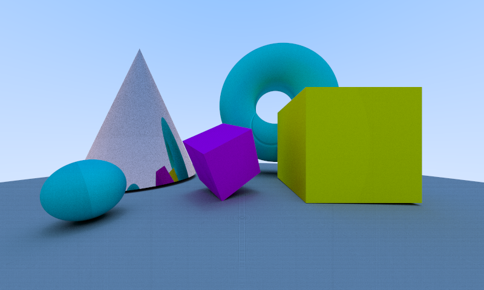
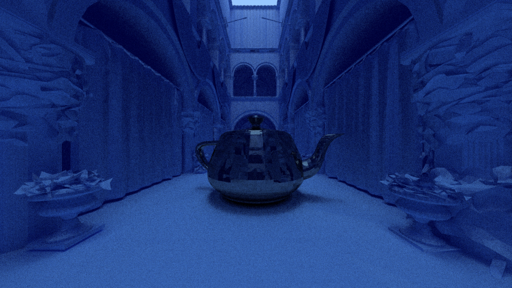

## SH-RayTracer






`SH-RayTracer` is open sourced CPU ray-tracing application, and coded based on C++17. 

[](https://app.codacy.com/app/liliilli/SH-RayTracer?utm_source=github.com&utm_medium=referral&utm_content=liliilli/SH-RayTracer&utm_campaign=Badge_Grade_Dashboard)
[](https://ci.appveyor.com/project/liliilli/sh-raytracer/branch/master)

## Features

* Customized Scene Loading using `json` file.
* Basic Material (`Lambertian`, `Metal`, `Dielectric`) Implementation
* Mutli-thread Rendering
* Customizable configuration using execute command arguments.
* Rendering Time Checking

## Installation

`SH-RayTracer` uses CMake as building system to support cross-platform. There are different ways to compile and build application by each platform.

### Common

`SH-RayTracer` uses below sub-libraries.

* DyUtils
  * DyMath
  * DyExpression
* stb
* nlohmann
* any boost version that implements UUID library. (`boost::uuid`)

To build `SH-RayTracer`, `DyUtils` library uses submodule so need to write below command codes prior to use CMake commands.

``` bash
> git submodule update --init --recursive
```

If you want to build application to output more information, install `boost 1.70.0` library. Application uses `boost::expected`.

### Windows

To build `SH-RayTracer` with visual studio, Visual Studio 2017 or latest required.

Recommend to use CMake GUI version or first make `./build` directory and cmake (optionally, add DyUtils flags like below)

``` bash
> mkdir build && cd build
> cmake .. -DMATH_BUILD_WITH_EXPR=ON -DMATH_BUILD_LIB=ON \
-DMATH_BUILD_WITH_BOOST=ON -DBOOST_ROOT="The path of boost library"
> or, cmake .. -DEXPR_BUILD_WITH_BOOST=ON -DMATH_BUILD_WITH_EXPR=ON \
-DMATH_BUILD_LIB=ON -DMATH_BUILD_WITH_BOOST=ON -DBOOST_ROOT="The path of boost library"
```

Afterward, open `ShRayTracer.sln` in `./build` directory and build `ALL_BUILD`.

### Linux with gcc (g++) or clang

To build `SH-RayTracer` with g++ or clang on `-inx`, C++17 Supported version compiler is required. You must add `Debug` or `Release` mode to compile it as debug (not optimized version) or release (fully-optimized version) version like a below.

``` bash
> mkdir build && cd build
> cmake .. \
-DMATH_BUILD_WITH_EXPR=ON -DMATH_BUILD_LIB=ON -DMATH_BUILD_WITH_BOOST=ON \
-DBOOST_ROOT="The path of boost library" \
-DCMAKE_BUILD_TYPE=Debug or Release
> or, cmake .. \
-DMATH_BUILD_WITH_EXPR=ON -DEXPR_BUILD_WITH_BOOST=ON \
-DMATH_BUILD_LIB=ON -DMATH_BUILD_WITH_BOOST=ON \
-DBOOST_ROOT="The path of boost library" \
-DCMAKE_BUILD_TYPE=Debug or Release
```

and

``` bash
> make
```

## Release Note

### `v190710` : v1.1.0 version

* Extended supported anti-aliasing sampling count to 64.
* Implement Bounding box, Reduced rendering time by 1/14 times (maximum case)
* Implement Fundamental SDF Shapes (Sphere, Box, Plane, Capsule, Cone and Torus) Torus will not be rendered on some points, but I should fix it up as soon as possible.
* Renew Json Scene Structure as `v190710` version on `meta` header.
* Add Plane OBJ (using internal material is not supported yet) loading and rendering feature.
* Automatic normal creation feature (not interpolated normal yet) on OBJ file when normal information is not found.
* Done optimization and Improved stability.

## Log

2019-06-04 : Create Document<br>
2019-06-05 : Add DEBUG & RELEASE building mode for Linux (GCC)<br>2019-07-10 : Update README to v190710.

## Copyright

> ```
> MIT License
> 
> Copyright (c) 2019 Jongmin Yun (Neu.)
> 
> Permission is hereby granted, free of charge, to any person obtaining a copy
> of this software and associated documentation files (the "Software"), to deal
> in the Software without restriction, including without limitation the rights
> to use, copy, modify, merge, publish, distribute, sublicense, and/or sell
> copies of the Software, and to permit persons to whom the Software is
> furnished to do so, subject to the following conditions:
> 
> The above copyright notice and this permission notice shall be included in all
> copies or substantial portions of the Software.
> 
> THE SOFTWARE IS PROVIDED "AS IS", WITHOUT WARRANTY OF ANY KIND, EXPRESS OR
> IMPLIED, INCLUDING BUT NOT LIMITED TO THE WARRANTIES OF MERCHANTABILITY,
> FITNESS FOR A PARTICULAR PURPOSE AND NONINFRINGEMENT. IN NO EVENT SHALL THE
> AUTHORS OR COPYRIGHT HOLDERS BE LIABLE FOR ANY CLAIM, DAMAGES OR OTHER
> LIABILITY, WHETHER IN AN ACTION OF CONTRACT, TORT OR OTHERWISE, ARISING FROM,
> OUT OF OR IN CONNECTION WITH THE SOFTWARE OR THE USE OR OTHER DEALINGS IN THE
> SOFTWARE.
> ```
